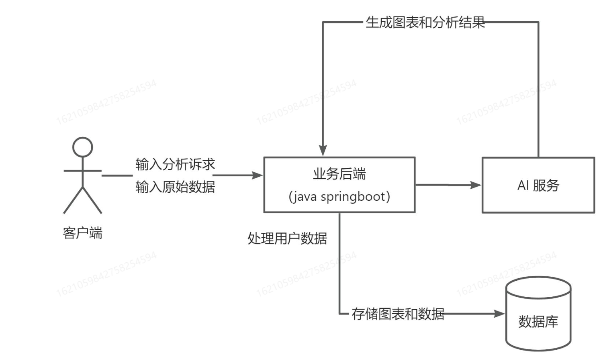
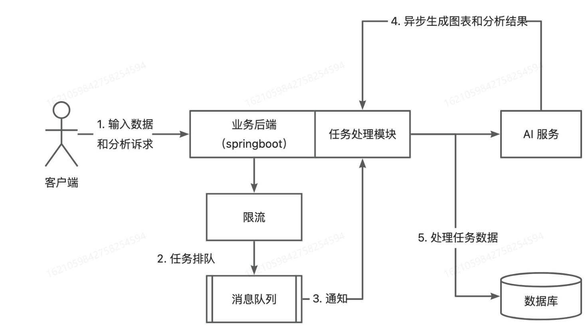

## 需求分析
    1.智能分析:用户输入目标和原始数据(图表类型)，可以自动生成图表和分析结论
    2.图表管理
    3.图表生成的异步化(消息队列)
    4.对接 AI 能力
## 架构图
- 基础流程

- 优化流程（异步化）

## 技术栈
### 前端
1. React
2. Umi + Ant Design Pro
3. 可视化开发库( Echarts + HighCharts + AntV)
4. umi openapi 代码生成(自动生成后端调用代码)
### 后端
1. Spring Boot(万用 Java 后端项目模板，快速搭建基础框架，避免重复写代码)
2. MySQL 数据库
3. MyBatis Plus 数据访问框架
4. 消息队列(RabbitMQ)
5. AI 能力(Open Al 接口开发/星球提供现成的 AI 接口)
6. Excel 的上传和数据的解析(Easy Excel)
7. Swagger + Knife4j 项目接囗文档 
8. Hutool 工具库

   
   
   
   

   

